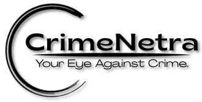
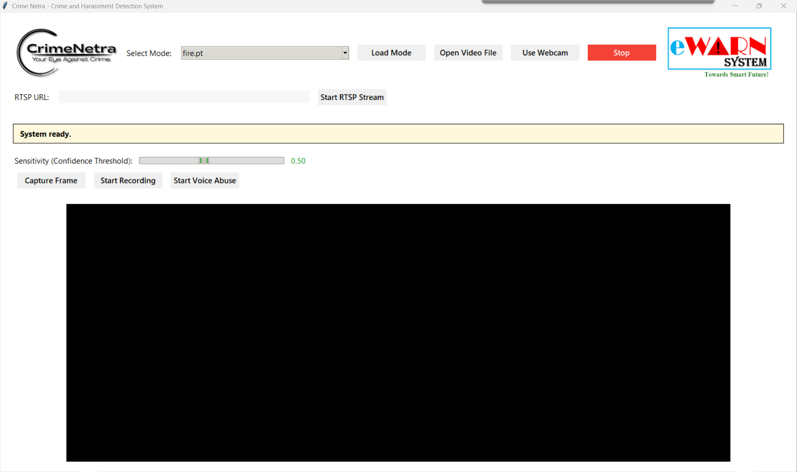
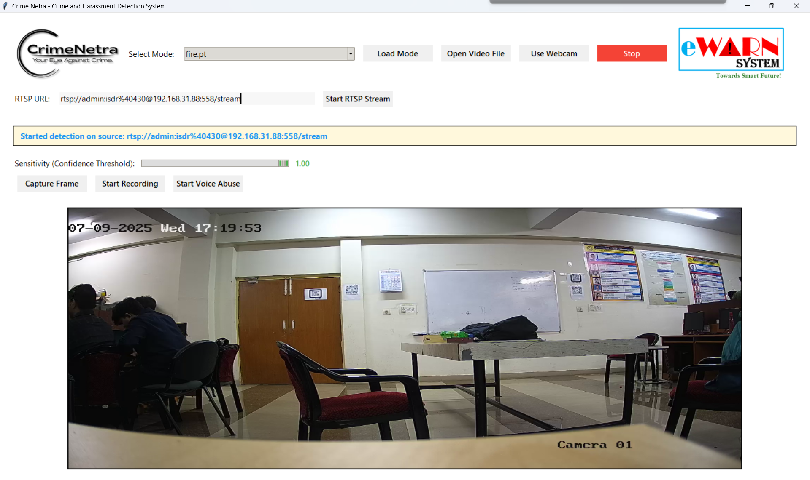

# 🛡️ CrimeNetra – Crime and Harassment Detection System

Crime Netra is an AI-powered intelligent surveillance system built using Python, Tkinter, YOLOv8, MediaPipe, and NLP (Natural Language Processing). It detects **crimes**, **harassment behavior**, and **verbal abuse** in real-time from webcam, video files, or RTSP streams. The system uses multiple ML algorithms and provides an interactive GUI.

---

## 📸 Preview





---

## 🧠 Project Highlights

| Feature                     | Description                                                       |
| --------------------------- | ----------------------------------------------------------------- |
| 🔍 **Crime Detection**      | Real-time object detection using YOLOv8 from Ultralytics.         |
| 🕵️ **Harassment Analysis** | Detects inappropriate behavior using pose estimation (MediaPipe). |
| 🔊 **Voice Abuse**          | Recognizes toxic speech with BERT-based NLP.                      |
| 🎥 Input Support            | Works with webcam, video files, and RTSP URLs.                    |
| 📂 Save Evidence            | Automatically captures frames of detected events.                 |
| 🖥️ Custom UI               | Built using Tkinter with styled buttons, sliders, and logging.    |

---

## 📂 File Structure

```
CrimeNetra/
├── app.py                      # Main script with complete UI + logic
├── models/                     # Place your YOLOv8 .pt models here
├── captures/                   # Captured screenshots saved here
├── records/                    # Saved video recordings
├── harassment_pictures/       # Harassment alert frames auto-saved here
├── utils/
│   └── helper.py              # Contains `get_tk_image()` for OpenCV to Tkinter
├── alert.wav                  # Sound played on detection
├── logo.png / logo1.png       # Logos for header/footer in GUI
├── README.md                  # Project documentation
└── images/                    # Screenshots used in README
```

---

## 🛠️ Setup Instructions

### 1. Clone the Repository

```bash
git clone https://github.com/TAPANANSHUTRIPATHY/CrimeNetra.git
cd CrimeNetra
```

### 2. Install Dependencies

```bash
pip install -r requirements.txt
```

If `requirements.txt` is missing, install manually:

```bash
pip install opencv-python pillow ultralytics speechrecognition transformers nltk mediapipe
```

### 3. Download NLTK Data (once only)

```bash
python -c "import nltk; nltk.download('punkt')"
```

### 4. Add YOLOv8 Model

Place any YOLOv8 `.pt` file inside `models/` directory. Example: `yolov8n.pt`

---

## 🚀 How to Run

```bash
python app.py
```

You will see a GUI interface. From there:

* Select a mode from dropdown
* Load a model or select Harassment/Voice
* Choose webcam/video/RTSP
* Start detection, capture frames, or record

---

## 🔧 Core Features Explained (Code Flow)

### ✅ `CrimeHarassmentApp.__init__()`

* Initializes all parameters, detection settings, pose estimators, UI setup.
* Defines constants like thresholds, folder paths, UI styles, fonts.

### 🎨 `setup_ui()`

* Builds the GUI using Tkinter widgets: Combobox, buttons, slider, canvas.
* Layout has: Top bar (mode select, file), bottom bar (RTSP), slider, log box.

### 🔍 `load_mode()`

* Loads:

  * `.pt` file as YOLOv8 model using `ultralytics.YOLO()`
  * `unitary/toxic-bert` as voice classifier (from HuggingFace)
  * Harassment detection mode using MediaPipe Pose

### 📹 `start_detection()`

* Starts webcam/video/RTSP detection for YOLO models
* Calls `detect_loop()` in a background thread

### 🔄 `detect_loop()`

* Captures frames using OpenCV
* Runs `model.predict()`
* Plots results and shows them in the canvas
* Records frames if enabled
* Triggers alert if 'theft' class is found

### 🕵️ `start_harassment_analysis()` / `analyze_harassment_video()`

* Processes frames for pose keypoints
* Calculates:

  * **Inappropriate touch**: wrist close to hip
  * **Stalking**: nose too close to hip region
* Saves frame immediately to `harassment_pictures/` on detection

### 🔊 `listen_voice_abuse()`

* Uses mic to record 5 sec speech
* Converts to text with Google Speech Recognition
* Detects toxicity using `toxic-bert`

### 📷 `capture_frame()`

* Saves current frame to `captures/` with timestamped filename

### 🎥 `toggle_recording()`

* Starts/stops OpenCV video writer
* Saves to `records/recording_TIMESTAMP.mp4`

---

## 🔌 Sensitivity Adjustment

* UI slider allows real-time control over YOLO detection threshold (0.1 to 1.0).
* Affects object detection confidence filtering.

---

## 🎓 Example Use Cases

* 📻 CCTV crime alert systems in public areas
* 🏫 School/campus harassment monitoring
* 📍 Live RTSP feed for building security
* 📢 Speech moderation in customer support

---

## 🔧 Customize or Extend

* Train custom YOLOv8 model for your classes (e.g., fight, fire, weapon).
* Add new alert sounds.
* Modify UI (dark theme, more controls).
* Replace toxic-bert with newer NLP models.

---

## 👤 Author

**Tapananshu Tripathy**
B.Tech CSE @ KIIT University
Intern @ CipherByte Technologies
[GitHub](https://github.com/Tapananshu-Tripathy) | [LinkedIn](https://linkedin.com)

---

## 📄 License

This project is licensed under the **MIT License**. You are free to use, modify, and share.

---

## 🔗 Need Help?

Feel free to [open an issue](https://github.com/TAPANANSHUTRIPATHY/CrimeNetra/issues) or reach out via email.

---

Thank you for using **Crime Netra** 🚀 Stay safe, stay smart.
